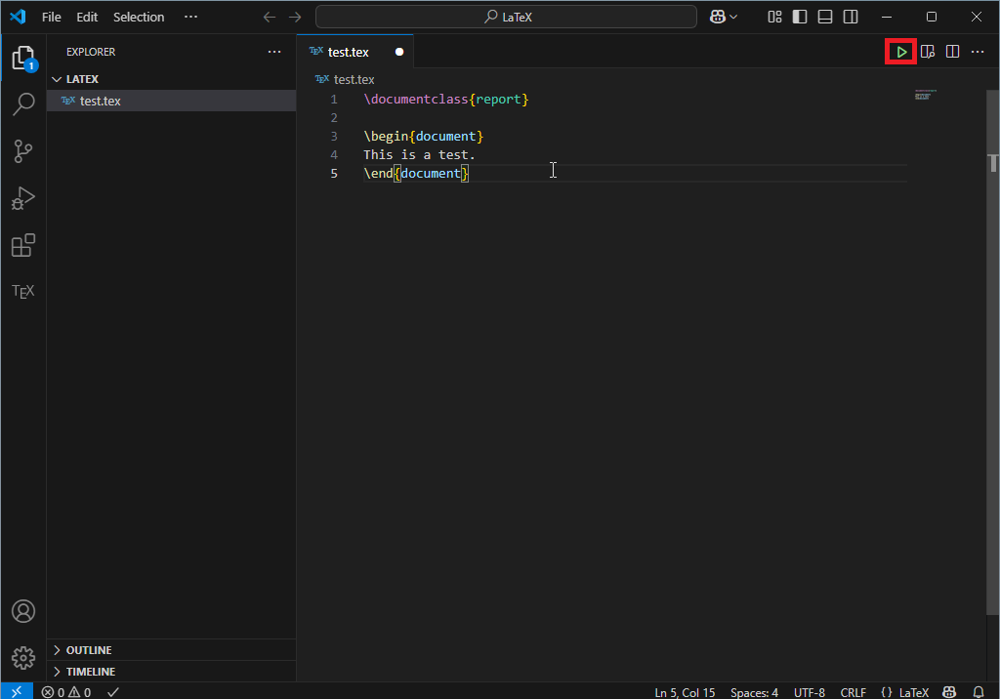
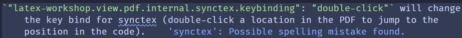
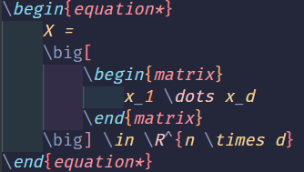
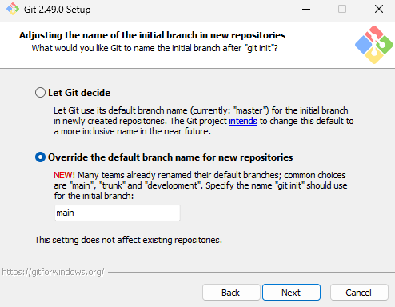
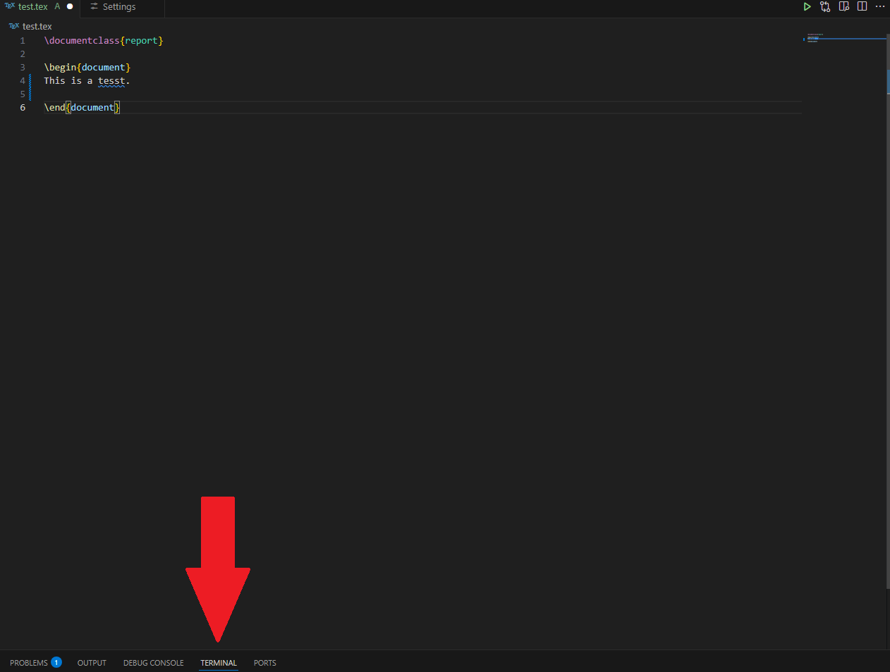
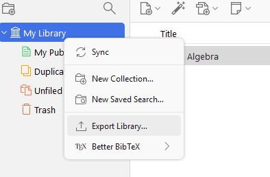
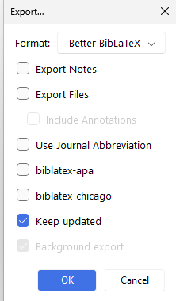

# LaTeX Workflow in VS Code

This is a guide for using LaTeX with VS Code.

### How it will look


## Table of contents

- [LaTeX](#1-latex)
- [VS Code](#2-vs-code)
    - [Installation](#installation)
    - [Configuration](#configuration)
        -  [Linting](#linting)
        -  [Output Files](#output-files)
        -  [LaTeX Workshop Settings](#latex-workshop-settings)
        -  [VS Code Settings](#vs-code-settings)
    -  [Extensions](#extensions)
        -  [LTeX+](#ltex)
        -  [Error Lens](#error-lens)
        -  [indent-rainbow](#indent-rainbow)
        -  [Optional](#optional-for-the-aesthetic)
- [Git](#3-git)
- [Zotero](#4-zotero)

## [1. LaTeX](#table-of-contents)

There are two mayor TeX distributions for Windows: TeX Live and MiKTeX.
I would recommend TeX Live, just because it has a larger user base and is available for macOS and Linux as well.

To start you need to download Tex Live from [here](https://www.tug.org/texlive/) and just follow the instructions of the installer.
The default settings contain the full installation, which I recommend so you don't have to worry about packages not being installed.

## [2. VS Code](#table-of-contents)

###  [Installation](#table-of-contents)

After installing LaTeX you only need a suitable compiler to build your documents.
I would highly recommend VS Code because it offers way more functionality and a cleaner look than dedicated LaTeX compiler like TeXworks or TeXstudio.
If you want the simplest experience without installing anything [Overleaf](https://www.overleaf.com/) is a valid alternative, although there are numerous drawbacks (e.g. it is only browser based so no offline compatibility).

To start, install VS Code from [here](https://code.visualstudio.com/download) and follow the instructions (keep it at default).
Afterward go to extensions with `Ctrl + Shift + X` or click the icon on the sidebar and install the extension **LaTeX Workshop** by James Yu.   
*Important*: Do a restart at this point, otherwise there might be problems.   
Now open your work folder and create a `.tex` file. 
You can compile that file by clicking the green arrow in the top right:

By pressing `Ctrl + Shift + V` the `.pdf` file is displayed next to the code.
Theoretically this is everything you need to get it working, but we will cover some configurations in the following paragraph to make the experience a lot better.

### [Configuration](#table-of-contents)

For the complete configuration you can just paste the content from [here](settings.json) and copy it in your `settings.json` file from VS Code. 
You can find that file by going to the command search with `Ctrl + Shift + P` and search for *Preferences: Open User Settings (JSON)*.
I will go through the contents of `settings.json` step by step and afterward we will install some other useful extensions to make your life easier.

####  [Linting](#table-of-contents)

Linting is like [spell checking](#ltex) (we will get to that later), but for your code.
It gives you error codes when you do something wrong and warnings if you should be doing something a different way.
The linter chktex is already installed with TeX Live and is activated by `"latex-workshop.linting.chktex.enabled": true`.  
I found some warnings to not be really useful, so I blocked them with:
```
"latex-workshop.linting.chktex.exec.args": [
    "-wall",
    "-n22",
    "-n30",
    "-e16",
    "-q",
    "-n21",
    "-n1"
    ]
```

#### [Output Files](#table-of-contents)

As you might have seen LaTeX produces a lot of temporary output files while building your PDF.  
`"latex-workshop.latex.outDir": "%DIR%\\build"` changes our output directory to a dedicated `build` folder to make our work folder a bit cleaner (this is optional and normally not strictly recommended because it's always best to keep the files where they are supposed to be, but I haven't had any issues so far).  
`"files.exclude": {...}` hides temporary files from view by excluding the specified file types.

#### [LaTeX Workshop Settings](#table-of-contents)

`"latex-workshop.latex.autoBuild.run": "onSave"` will automatically build our PDF whenever we save our document with `Ctrl + S`.  
`"latex-workshop.view.pdf.internal.synctex.keybinding": "double-click"` will change the key bind for synctex (double-click a location in the PDF to jump to the position in the code).
For the other way around (from code to PDF) the default is `Ctrl + Alt + J`.

#### [VS Code Settings](#table-of-contents)

`"editor.cursorSmoothCaretAnimation": "on"` and `"editor.cursorBlinking": "expand"` just make the cursor look a bit nicer.  
`"editor.wordWrap": "on"` and `"editor.wrappingIndent": "indent"` will dynamically adjust the line width based on the window size.  
`"workbench.activityBar.location": "top"` changes the location of the sidebar and makes it less prominent.  
*Optional*: `"github.copilot.editor.enableAutoCompletions": false` disables copilot because I find it rather distracting while writing.

### [Extensions](#table-of-contents)

These are some additional extensions I recommend.

#### [LTeX+](#table-of-contents)

This is for (actually pretty good) spell and grammar checking.
The normal LTeX (without the +) doesn't seem to be maintained anymore.
You can change the desired language by opening the VS Code-Settings with `Ctrl + ,` and search for *ltex.language*.

#### [Error Lens](#table-of-contents)

This will display the errors or warnings directly in the corresponding lines in the source code which makes it a lot quicker to find:  


#### [indent-rainbow](#table-of-contents)

This will make your code easier to read by coloring indents:  


#### [Optional for the aesthetic](#table-of-contents)

- **Catppuccin for VS Code**: My favorite theme for VS Code. After installing, you can change the color theme by pressing `Ctrl + Shift + P` and change the *Preferences: Color Theme*. In my case its Catppuccin Macchiato.
- **Material Icon Theme**: Changes the file icons in the file manager.
To activate it add `"workbench.iconTheme": "material-icon-theme"` to `settings.json`.
- *Not an extension*: **FiraCode Nerd Font**: You can download it from [here](https://www.nerdfonts.com/font-downloads).
After downloading, unpack the file, select all the font files, and right-click → *Install*.
    - To activate the font and make it look even nicer, add this to your `settings.json`:
    ```
    "editor.fontFamily": "FiraCode Nerd Font",
    "terminal.integrated.fontFamily": "monospace",
    "editor.fontLigatures": "'zero', 'ss02', 'ss03', 'ss04', 'ss05', 'calt'"
    ```

### [3. Git](#table-of-contents)

Git is a powerful version control system.
Every time you save your files with Git, a version is stored while keeping all previous versions intact. 
This allows you to go back to any earlier state if needed.  
Although Git works locally on your machine, you can connect it to remote repositories like GitHub. This provides a secure backup and allows you to access your files from different devices.
Integrating Git with VS Code is pretty straight forward:  
1. Install Git for Windows from [here](https://git-scm.com/downloads).
- Keep the default settings.
- (Optional) Change the default branch name to "main":  


2. Create a GitHub account at [GitHub](https://github.com/). 

3. Create a repository on GitHub (private or public, depending on your preference).

4. Got to the terminal in VS Code while your work folder is open:   
  

5. Run the following commands in the terminal:
```
git init
git config --global user.name "Your-GitHub-Username"
git config --global user.email "your@githubmail"
git add .
git commit -m "Initial commit"
git remote add origin https://github.com/YourUsername/my-project.git
git branch -M main
git push -u origin main
```
5. Congratulations! 🎉 You made your first commit!
- Try to make it a habit to commit before major changes.
- Regular commits (e.g., every evening) help track your progress, especially when working on long-term projects like a thesis.

6.  New commits can be made by the following commands:
```
git add .
git commit -m "Commit note"
git push origin main
```

### [4. Zotero](#table-of-contents)

Zotero is a free, open-source reference management tool that helps you to organize, cite, and share research materials.
It helps *a lot* while writing academic papers, as it eliminates the hassle of managing citations or storing research materials.  
Another bonus is its high compatibility with LaTeX and VS Code which we will see now.

1.  Install Zotero from [here](https://www.zotero.org/).
2.  Install the browser add-on for your preferred browser.  
This allows you to save books, papers, and other sources directly to your Zotero library with a single click, including all the citation information automatically. 
3. Install the Plugin **Better BibTex** for Zotero from [here](https://retorque.re/zotero-better-bibtex/installation/) and follow the instructions there to add it to Zotero.
4. To export your library to your work folder, right-click your library and choose *Export Library*:  
  
Now, set *Better BibLaTeX* as the format and check *Keep updated*:   
  
Choose your work folder and rename the file to `literature`
5. Now, every time you add resources to your Zotero library, they will automatically be added to your `literature.bib` file for LaTeX.


